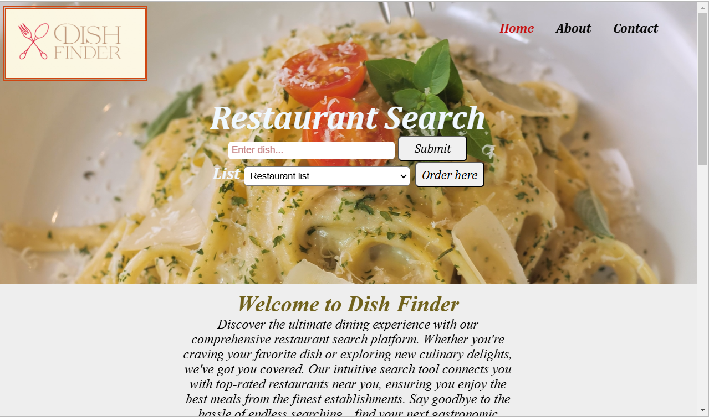

<h1 style="text-align:center;">DishFinder</h1>

# Table of Contents
1. [Introduction](#introduction)
2. [Purpose](#purpose)
3. [Deployment](#deployment)
4. [User-Experience](#user-experience)
5. [Design](#design)
6. [Colour-Scheme](#colour-scheme)
7. [Typography](#typography)
8. [Imagery](#imagery)
9. [Testing](#testing)
10. [Wireframes](#wireframes)

# Introduction
 - Welcome to [DishFinder](https://farah-94.github.io/Dishfinder/index), this is an innovative website designed to revolutionize the way you discover and enjoy your favorite dishes. Experinece the power of HTML, CSS, and JavaScript, our platform provides a seamless and engaging user experience. On the backend, we've integrated Node.js and Express to provide the great performance and efficient server-side operations. Additionally, jQuery enhances the interactivity and responsiveness of our site.

 ## Purpose
  - DishFinder allows you to search for any dish by name and instantly find nearby restaurants that offer it with high ratings. Whether you're planning to dine out or prefer the convenience of ordering online, our platform provides you with the option to book a table or place an order directly from the comfort of your home.

 ## Programme used
 1. [Google Fonts](https://fonts.google.com/)
 2. [githUb](https://github.com/)
 3. [Figma](https://www.figma.com/)
 4. [jQuery](https://jquery.com/) 
 5. [Freepik](https://www.freepik.com/)
 6. [logoapp](https://logo.app/?msclkid=e9b12584f9051a2a4d83423abcfe4636&utm_source=bing&utm_medium=cpc&utm_campaign=Logo%20Design&utm_term=logo%20creator&utm_content=Logo%201)
 7. [w3school](https://www.w3schools.com/)
 8. [Gantt Chart](https://create.microsoft.com/en-us/templates/gantt-charts)

## Deployment
1. Login to GitHub
2. From the list of the repositories on the screen, select projectonemilestoneone
3. From the menu items near the top of the page, select settings
4. Scroll down to the GitHub Pages section
5. Under source click the drop-down menu labelled Name and select Master Branch
6. On selecting Master Branch, the page is automatically refreshed, and the website is now deployed.
7. At the moment of submitting the Milestone project, the Development Branch and Master Branch are identical.

## How to Run the Project Locally
1. A Github account. Create a Github Account [here](https://github.com/join)
2. Use the Chrome browser then follow these steps:
   - Install the Gitpod Browser Extension for Chrome
   - After installation, restart the browser
   - Log into Gitpod with your Gitpod account
   - Navigate to the Project Github repository
   - Click the green "Gitpod" button in the top right corner of the repository
   - This will trigger a new Gitpod workspace to be created from the code in Github where you can work locally.
3. To work on the project code within a local IBE such as VSCode, Pycharm, etc.
   - Follow the link to the Project Repository
   - Under the repository name, click "clone or download".
   - In the clone with HTTPs section, copy the clone URL for the repository
   - In your local IBE, open the terminal
   - Change the current working directory to the location where you want the cloned directory to be made.
   - Type `git clone`, and then paste the URL you copied in Step 3:   `https://github.com/Farah-94/Dishfinder`
   - Press Enter. Your local clone will be created.

## User Experience
  ### User stories
   * First-time Visitor 
     - For first-time visitors, we aim to make your initial interaction smooth and intuitive.
     - The website is designed with a straightforward layout, making it easy to explore and easy to understand.
     - Users can find their expected results without any hassel.
     -  Users can search their favourite dish on the serach bar, which can be seen on top of the website 
     - Users can instatntly get a list of restaurants with their complete information about their rating and addresses.
     - After search, users have two options
         - Online Order
         - Book A Table

   * Return Visitor 
     - For return visitors, we focus on enhancing convenience and        personalization.  
     -  Stay informed with the latest restaurant reviews and special offers from your favorite places.
 
   * Visitor Goals
     - Whether you're looking to try a new cuisine or find a hidden gem in your area, our robust search functionality will help you discover highly-rated restaurants.
     - Craving a particular dish? Use our search feature to find restaurants that serve exactly what you're looking for.
     - We provide you best restaurants details. So you can make your decision.
     - Our website helps you plan your dining experiences by book a table.  

### Design
 * Simplicity
     - We maintain a clean and simple design to enhance usability.
 * Consistency
     - Consistent design elements are used throughout the site.
 * Accessibility
     - We ensure that our design is accessible to all users, including those with disabilities.
 * Layout 
     - Our layout is designed to be responsive and adaptable to different screen sizes.
     - We use a flexible design to ensure content is well-organized and easy to navigate.
 * Responsive Design
     - The website is optimized for both desktop and mobile devices, providing a seamless experience across all platforms.
 * Language used 
     - **HTML**, **CSS** and **JavaScript**

## Wireframes
- [index.html](https://www.figma.com/design/FendFc4wz0zGChrs1P6zh1/DishFinder?m=auto&t=D0OllQeRbRTAJY2U-6)
- [order.html](https://www.figma.com/design/FendFc4wz0zGChrs1P6zh1/DishFinder?node-id=9-2&t=vAhhSK0mWCHZa5kp-1)
- [booktable.html](https://www.figma.com/design/FendFc4wz0zGChrs1P6zh1/DishFinder?node-id=9-27&t=vAhhSK0mWCHZa5kp-1)

## Gantt Chart
- [Project Gantt Chart](https://1drv.ms/x/c/e1af83f369e97fb7/EbNxbjGCaRRPi7g7jGNPP9AB8MPIjW2vIQChNVPAcso9Ww?e=mla60Y)

### Colour Scheme
 *  index.html 
    - page background-color: white 
    - header background-color : #968e5c          
    - footer background-color : #6f4b1c
    - content background-color :rgb(229, 196, 153)

 * order.html
    - page background-color: white 
    - form background-color : #eadc9c         
         
 * booktable.html
    - page background-color: white 
    - form background-color : #eadc9c     

### Typography
* Google Fonts 
     - Google italic fonts : @import url('https://fonts.googleapis.com/css2?family=Cabin:ital,wght@0,400..700;1,400..700&family=Philosopher:ital,wght@0,400;0,700;1,400;1,700&family=Vesper+Libre:wght@400;500;700;900&display=swap');

### Imagery
  #### Index.html
   ##### Logo
- [logo](images/logo3.png)     
  - logo created by [logo.app](https://logo.app/?msclkid=ba7cfa0b51671acf237c9db510c797c7&utm_source=bing&utm_medium=cpc&utm_campaign=Logo%20Design&utm_term=logo%20maker%20free&utm_content=Logo%201)
* Content Images 
- [restaurant-slider](images/one.jpg)
- [restaurant-slider](images/two.jpg)
- [restaurant-slider](images/three.jpg)
- [restaurant-slider](images/four.jpg)
- [restaurant-slider](images/five.jpg)
- [restaurant-slider](images/six.jpg)
- [review-person](images/person1.jpg)
- [review-person](images/person2.jpg)
- [review-person](images/person3.jpg)
- [review-person](images/person4.jpg)
- [review-person](images/person5.jpg)
- [review-person](images/person6.jpg)
   - Images taken from [Freepik](https://www.freepik.com/)

## Testing

  - [Test Plan](https://1drv.ms/w/c/e1af83f369e97fb7/EeGRedxvcdJFsWF-GYSQpH0BGP9XWgRi9BNgFmlA6PDrhQ?e=lGBLSr)

### HTML Validation
- [index.html](/images/index.html%20validation.png)
- [order.html](/images/order.html%20validation.png)
- [bookTable.html](/images/booktablehtml%20validationpng)

### Css Validation
- [style.css](/images/css%20validation.png)

### Performance
- [Page performance mobile](/images/performance.png)
- [Page performance desktop](/images/performance%20(2).png)

### JSHint
- [JSHint](/images/jshint.png)